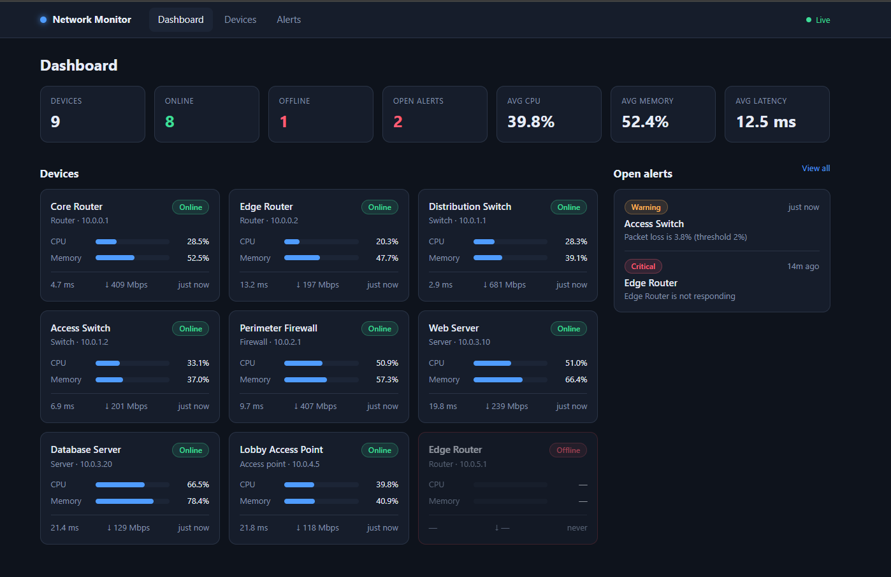
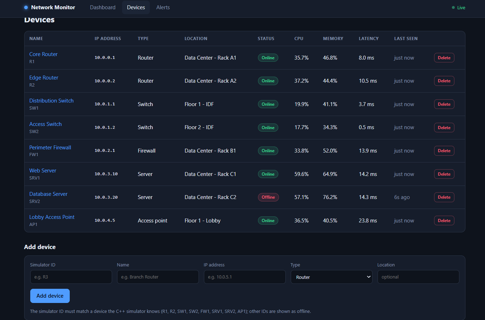
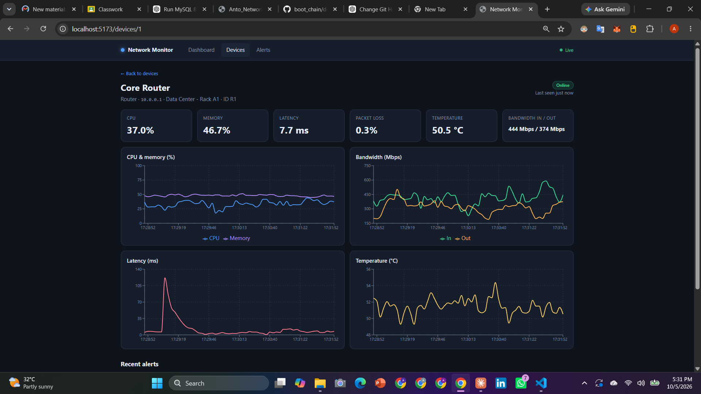
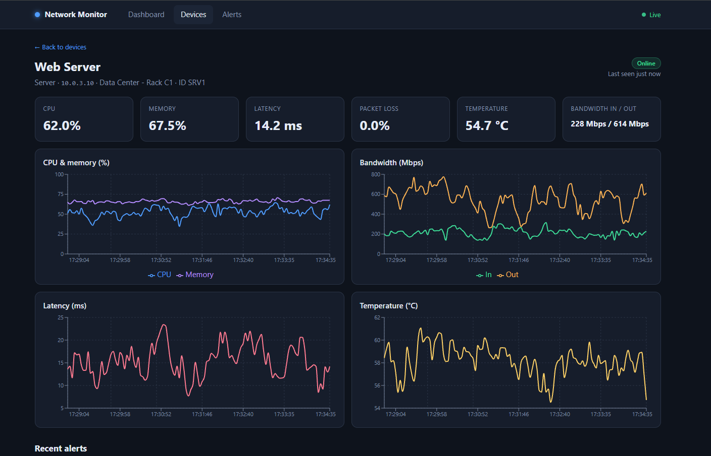
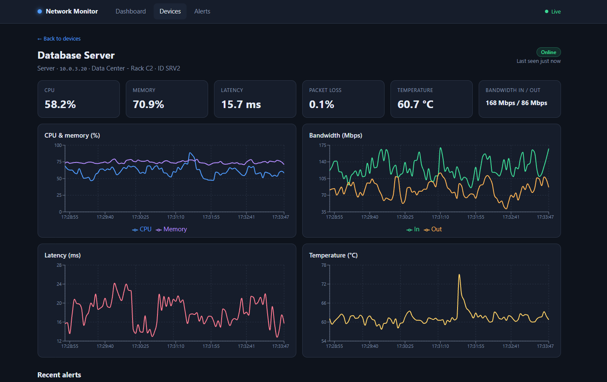

# Network Monitor

A small full-stack network monitoring project. A C++ simulator pretends to be a rack of network devices, a Node/TypeScript backend polls and stores their metrics and raises alerts, and a React dashboard shows everything live.



## Features

- **Live dashboard** with fleet totals (devices, online, offline, open alerts, average CPU / memory / latency), a card per device, and a list of open alerts.
- **Device management**: list, add and delete devices, with live status, CPU, memory, latency and last-seen time.
- **Per-device detail pages** with six live metrics and four real-time charts (CPU & memory, bandwidth in/out, latency, temperature).
- **Automatic alerting** for high CPU, memory, latency, temperature, packet loss, and offline devices. Alerts open and resolve on their own.
- **Real-time updates** pushed to the browser over WebSocket (the "Live" indicator in the top bar).
- **Failure simulation**: force a device down or up from the command line, and the simulator also spikes metrics and drops devices at random.

## Architecture

```
C++ device simulator  --TCP-->  Node/TypeScript backend  --REST + WebSocket-->  React dashboard
   (fake devices)                 (polls, stores, alerts)                        (live charts)
                                         |
                                       MySQL
```

| Part | Tech | Port |
|------|------|------|
| `device-simulator/` | C++17, POSIX/Winsock sockets, CMake | 9000 (TCP) |
| `backend/` | Node.js, Express, TypeScript, mysql2, Socket.IO | 5000 |
| `frontend/` | React 18, Vite, TypeScript, Recharts | 5173 |
| `database/` | MySQL 8 (MariaDB 10.5+ also works) | 3306 |

The backend polls the simulator every 3 seconds, saves each reading to MySQL, raises and resolves alerts, and pushes everything to the browser over WebSocket.

## Screenshots

### Devices

Every monitored device with its type, location, status and latest metrics. New devices are added from the form below the table.



### Device detail

Click a device to see live charts of its last few minutes of history.



| Web Server (SRV1) | Database Server (SRV2) |
|---|---|
|  |  |

---

## Prerequisites

- **MySQL 8** running locally
- **Node.js 18+** and npm
- **CMake 3.10+** and a C++17 compiler (g++, clang, or MSVC)

## Getting started

Run these in order, using a separate terminal for each long-running process.

### 1. Database (once)

From the project root:

```bash
mysql -u root -p < database/schema.sql
mysql -u root -p network_monitor < database/seed.sql
```

Both scripts are safe to re-run; they never drop data.

Then open `backend/.env` and set `DB_USER` / `DB_PASSWORD` to match your MySQL login.

### 2. Device simulator (terminal 1)

```bash
cd device-simulator
cmake -S . -B build
cmake --build build
./build/device-simulator
```

On Windows with the Visual Studio generator the binary is `build\Debug\device-simulator.exe`; with MinGW it is `build\device-simulator.exe`.

Options: `--port 9000` (default) and `--host 127.0.0.1` (default).

### 3. Backend (terminal 2)

```bash
cd backend
npm install
npm run dev
```

You should see `MySQL connected` and `Monitoring started`.

### 4. Frontend (terminal 3)

```bash
cd frontend
npm install
npm run dev
```

Open **http://localhost:5173**.

---

## Trying it out

Simulate a device failure and watch the dashboard react: an alert appears, then resolves when the device recovers.

```bash
# Linux/macOS (needs netcat)
echo "DOWN FW1" | nc 127.0.0.1 9000
echo "UP FW1"   | nc 127.0.0.1 9000
```

```powershell
# Windows PowerShell
$c = New-Object Net.Sockets.TcpClient("127.0.0.1", 9000)
$w = New-Object IO.StreamWriter($c.GetStream()); $w.AutoFlush = $true
$w.WriteLine("DOWN FW1")    # later: $w.WriteLine("UP FW1")
```

The simulator also randomly spikes CPU, latency and other metrics and briefly takes devices offline, so alerts appear on their own.

> **Note:** a device's `sim_id` must match one the simulator knows. If you add a device with any other ID (for example the extra "Edge Router" at `10.0.5.1` in the dashboard screenshot), it is shown as **Offline** with no metrics and raises a "not responding" alert.

## Simulator

Device IDs: `R1 R2 SW1 SW2 FW1 SRV1 SRV2 AP1` (must match `sim_id` in `database/seed.sql`).

### Protocol (one line in, one line out)

| Command | Reply |
|---------|-------|
| `PING` | `PONG` |
| `LIST` | `{"devices":["R1","R2",...]}` |
| `ALL` | `{"devices":[{...},{...}]}` |
| `GET <id>` | `{"id":"R1","status":"online","metrics":{...},"timestamp":...}` |
| `DOWN <id>` / `UP <id>` | `{"ok":true}` (force offline / online) |

## REST API

| Method | Path | Description |
|--------|------|-------------|
| GET | `/api/health` | Liveness check |
| GET | `/api/devices` | All devices with their latest metric |
| POST | `/api/devices` | Add a device (`sim_id`, `name`, `ip_address`, `type`, `location?`) |
| GET | `/api/devices/:id` | One device |
| PUT | `/api/devices/:id` | Update fields |
| DELETE | `/api/devices/:id` | Delete (cascades metrics and alerts) |
| GET | `/api/devices/:id/metrics?limit=60` | Recent history, oldest first (max 500) |
| GET | `/api/alerts?status=open\|resolved\|all&device_id=&limit=` | Alerts |

### WebSocket events

`metric:update`, `device:status`, `alert:new`, `alert:resolved`

## Configuration (`backend/.env`)

| Variable | Default | Meaning |
|----------|---------|---------|
| `DB_HOST` `DB_PORT` `DB_USER` `DB_PASSWORD` `DB_NAME` | localhost / 3306 / root / (empty) / network_monitor | MySQL connection |
| `PORT` | 5000 | API port |
| `CORS_ORIGIN` | http://localhost:5173 | Allowed browser origin |
| `SIM_HOST` `SIM_PORT` | 127.0.0.1 / 9000 | Where the simulator listens |
| `POLL_INTERVAL_MS` | 3000 | Polling period |
| `METRIC_RETENTION_HOURS` | 24 | Older metric rows are deleted hourly |

## Alert thresholds

Defined in `backend/src/services/monitoringService.ts`:

| Metric | Warning | Critical |
|--------|---------|----------|
| CPU | 80 % | 92 % |
| Memory | 85 % | 95 % |
| Latency | 100 ms | 200 ms |
| Temperature | 70 °C | 80 °C |
| Packet loss | 2 % | 5 % |

A device that stops responding raises a critical "not responding" alert.

## Production build

```bash
cd backend  && npm run build && npm start      # compiled server from dist/
cd frontend && npm run build                   # static files in dist/
```
